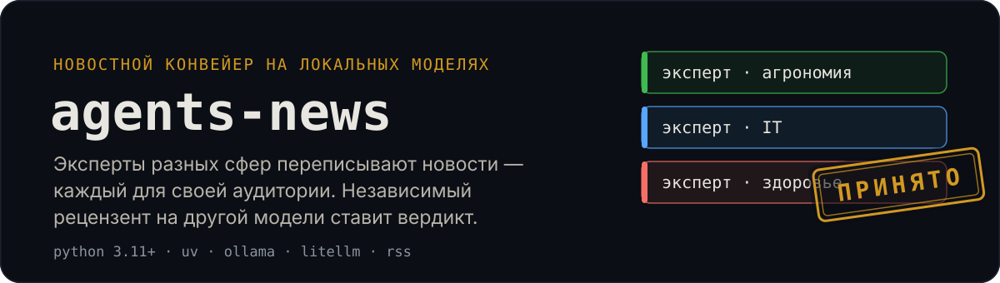
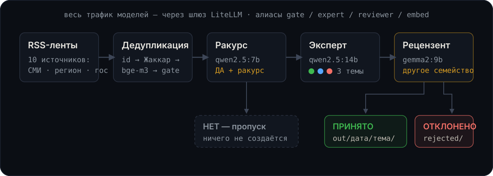

<p align="center">
  
</p>

Группа LLM-агентов на локальных моделях: парсит новостные RSS-ленты и
переписывает каждую новость под свою тему — агроном для аграриев, айтишник
для IT-аудитории, медик для темы здоровья. Новость не по теме — эксперт её
молча пропускает. Отдельный рецензент на модели **другого семейства**
сверяет статью с исходником и ставит вердикт, чтобы не «подсуживать» своим.

Всё работает локально: Ollama + шлюз LiteLLM, без внешних API.

## Пример результата

Реальный файл из прогона по ленте Habr — `out/2026-08-17/it/вебинар-как-использовать-mig-и-gpu-sharing-на-примерах.md`:

```markdown
---
source: https://habr.com/ru/companies/astralinux/news/1071212/
expert: it
expert_model: expert
reviewer_model: reviewer
verdict: ПРИНЯТО
date: 2026-08-17
---

# Вебинар: Как использовать MIG и GPU-Sharing на примерах

Компания Астралайнкс организовала вебинар, посвящённый использованию
технологии MIG (Multi-Instance GPU) и методике совместного использования
GPU на платформе Kubernetes. …

## Замечания рецензента

* Статья не содержит фактов, которых нет в исходной новости.
* Смысл статьи соответствует смыслу исходной новости.
* Тема статьи раскрыта и соответствует заявленной.
```

Если рецензент отклоняет статью, эксперт один раз дорабатывает её по
замечаниям и статья уходит на повторную рецензию (счётчик — в поле
`revisions`). Отклонённые повторно статьи сохраняются в
`out/<дата>/<эксперт>/rejected/` — с предупреждением в логе и в итоговой
строке запуска.

## Как это работает

<p align="center">
  
</p>

Код оперирует только алиасами моделей через один OpenAI-совместимый endpoint
шлюза LiteLLM. Какая модель стоит за алиасом — решает `litellm.config.yaml`:
замена модели или переход на облачный API — одна строка конфига, код не
меняется. Независимость рецензента (другое семейство моделей) — свойство
конфигурации шлюза, его нельзя случайно сломать в коде.

| Роль | Алиас | Модель (по умолчанию) | Задача |
|------|-------|----------------------|--------|
| Фильтр | `gate` | `qwen2.5:7b-instruct` | «ДА/НЕТ»: относится ли новость к теме эксперта |
| Эксперты | `expert` | `qwen2.5:14b-instruct-q4_K_M` | Переписать новость для своей аудитории, только факты исходника |
| Рецензент | `reviewer` | `gemma2:9b` | Сверить статью с исходником: выдумки, искажения, тема |
| Эмбеддинги | `embed` | `bge-m3` | Векторы заголовков для поиска дублей между сайтами |

Если RSS-описание короче 200 символов (типично для госновостей), перед
обработкой догружается полный текст страницы (trafilatura, до 4000 символов).

## Быстрый старт

Нужны установленные [Ollama](https://ollama.com) с моделями из таблицы выше
и [uv](https://docs.astral.sh/uv/).

```bash
make install     # зависимости
make gateway     # терминал 1: шлюз LiteLLM на :4000
make run-once    # терминал 2: пробный прогон — 1 новость, без записи состояния
make run         # боевой прогон: все новые новости из лент
make test        # тесты (без сети и LLM)
```

### Docker

```bash
make image       # собрать образ agents-news
make run-image   # запустить пайплайн в контейнере (шлюз и Ollama — на хосте)
```

Готовый образ собирается CI и публикуется в
`ghcr.io/fgeeha/agents-news` на каждый пуш в `Master`.

## Дедупликация

Один сюжет с разных сайтов не порождает повторных статей. Все уровни
опираются на `state/seen.json` (сброс — `rm -rf state` или `--no-state`):

1. **id/ссылка** — новость не обрабатывается повторно между запусками;
2. **каскад по заголовку** (`feeds.Deduper`, последние 500 заголовков):
   - Жаккар по значимым словам ≥ 0.6 → дубль (перестановки слов, бесплатно);
   - косинус эмбеддингов `bge-m3`: ≥ 0.85 → дубль, < 0.55 → не дубль;
   - серая зона [0.55, 0.85) → gate-модель отвечает, одно ли это событие.

Пороги откалиброваны на реальных парах заголовков (2026-08-17): пересказы
одного события дают косинус 0.52–0.99, разные события той же темы —
0.44–0.69, поэтому серую зону без LLM-подтверждения не разделить. При
недоступности эмбеддингов детектор деградирует до Жаккара с предупреждением.

## Источники

Все проверены на живой RSS 2026-08-17:

- **федеральные СМИ**: lenta.ru, habr.com;
- **волгоградские СМИ**: v1.ru, bloknot-volgograd.ru, vpravda.ru,
  volgograd.kp.ru, riac34.ru;
- **госисточники**: volgoduma.ru, kremlin.ru, government.ru.

RSS проверялись также у volgograd.ru, volgadmin.ru, 34.mchs.gov.ru,
duma.gov.ru, mcx.gov.ru, minzdrav.gov.ru, digital.gov.ru,
34.rospotrebnadzor.ru — лент у них нет.

## Настройка

Новый эксперт или лента — только `config.yaml`, код не трогается:

```yaml
experts:
  - name: finance
    title: Эксперт по финансам
    domain: экономика, банки, инвестиции, рынки
    model: expert          # или отдельный алиас из litellm.config.yaml

feeds:
  - https://www.finam.ru/analysis/conews/rsspoint/
```

Отдельная модель для эксперта — новый алиас в `litellm.config.yaml` + его
имя в поле `model`. Вместо LiteLLM можно указать в `config.yaml` прямой
endpoint Ollama (`http://localhost:11434/v1`) с реальными именами моделей —
код не изменится.

Локальному шлюзу аутентификация не нужна; если LiteLLM развёрнут с
`LITELLM_MASTER_KEY`, ключ пайплайна задаётся переменной окружения
`LITELLM_API_KEY`, не в конфиге.

## CI

GitHub Actions (`.github/workflows/ci.yml`): на каждый push и pull request —
`ruff` + `pytest`; на push в `Master` дополнительно собирается Docker-образ
и публикуется в GHCR.

## Ограничения и развитие

- Полный текст догружается только при коротком RSS-описании; для остальных
  используется описание из ленты. Дальше: догружать всегда.
- После «ОТКЛОНЕНО» эксперт дорабатывает статью один раз (`MAX_REVISIONS`
  в `pipeline.py`). Дальше: вынести лимит в конфиг.
- Фильтр релевантности — вызов «ДА/НЕТ» на пару новость×эксперт. Дальше:
  классифицировать новость по всем темам одним вызовом.
- Запуск ручной или по расписанию снаружи (cron/systemd-timer на `make run`).
